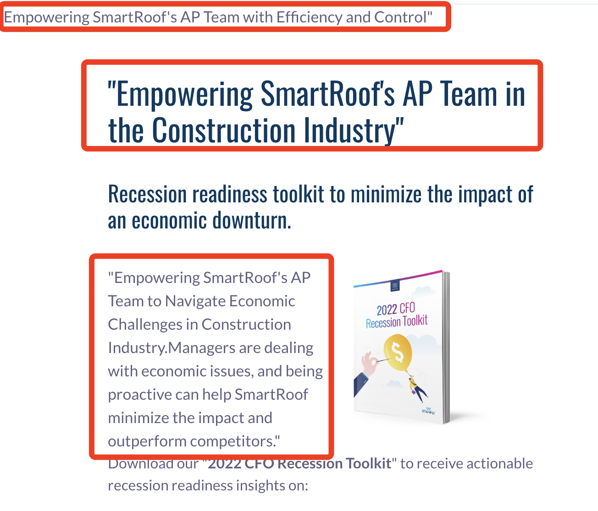

# Landing Page Generation Pipeline

This project generates personalized landing pages for Tofu clients based on background information collected from the **company_info.json** and **target_info.json** about account, industry, and persona descriptions. The entire process is divided into three main stages where OpenAI's API is utilized for content generation and personalization. Below is a breakdown of the workflow:

### **Workflow Overview**

1. **Company and Account Summary Generation**
   * The system begins by parsing structured JSON files for** ****company\_info** and** ****target\_info**.
   * It extracts and summarizes** ****Stampli’s core services** and the** ****target account’s profile** using OpenAI.
   * Long texts (e.g., product overviews) are split into chunks and proportionally summarized to stay within token limits.
2. **Strategic Pitch Generation**
   * With both summaries in hand, the system matches the account with the most relevant** ****industry** and** ****persona** entries.
   * Based on this alignment, OpenAI generates a** ****strategic marketing pitch** (around 2000 words), personalized to the target account’s needs and context.
3. **HTML Placeholder Content Generation**
   * The system parses the provided** ****HTML template**, identifying placeholder tags and extracting original content length and structure.
   * Using the pitch and placeholder metadata, OpenAI generates content tailored to each tag, maintaining layout consistency and contextual relevance.
4. **Final Landing Page Rendering**
   * The** ****`page_render`** function replaces HTML content using the generated mapping, preserving structural fidelity.
   * The output is a fully customized landing page for the target account.

### **Improvements Over Previous Design**

* ** ****Modularized**: Each step is encapsulated as a standalone function/tool, improving reusability and maintainability.
* ** ****Clear Logical Chain**: From data parsing → summarization → classification → generation → rendering, the flow is explicitly defined.
* ** ****Memory-Optimized**: Repeated content like summaries are stored using LangChain memory, reducing redundant API calls.
* ** ****Token-Conscious Design**: Long inputs are chunked and summarized proportionally to maximize content fidelity within token limits.

### **Integrate LangChain Memory**

To reduce redundant API calls and improve performance, we integrated** ****LangChain's memory module**. This allows the system to** ****cache previously generated summaries** (e.g., company or account descriptions), so they can be reused in subsequent steps or requests without re-generating, improving efficiency and consistency across the content pipeline.

### **Handling Token Limitations**

To handle OpenAI’s token limits (e.g., 4096 tokens for** **`gpt-3.5-turbo`), this system splits long texts through multi OpenAI API calls—like company or industry descriptions, into chunks, summarizes each proportionally, and then combines the results into a final concise summary. This ensures essential content is preserved while staying within the model’s limits.

### **Setup and Usage Instructions:****

To run this project, you need to install the necessary dependencies and set up OpenAI API access. Please follow these steps:

```bash


# Clone the project
git clone https://github.com/pinxiang-wang/tofu-take-home.git
cd tofu-take-home

# Install required Python packages
pip install -r requirements.txt

export OPENAI_API_KEY="your-api-key-here"

# Run the pipeline demo:
python content_gen_pipeline_demo.py

# Run the newest pipeline demo:
python content_gen_gemo_with_planner.py

```

### Demo Output Screeshot



### Description of the new Update:

## Latest Project Update 

### New Structure Overview

All updated code is organized under the `src_` folder with a clear modular design:

- **core/**
  Contains the main logic for content generation.
  Includes multiple specialized GPT Agents (e.g., URL analysis, marketing pitch generation, web content rewriting) following clean OOP principles.
- **entity/**
  Defines Data Transfer Objects (DTOs) such as `FieldTemplate`, and implements cache management and persistence mechanisms.
- **utils/**
  Provides wrapped utility methods for agent invocation, HTML parsing, structured data extraction, retry mechanisms, and more.

### Major Design Improvements

- **OOP Architecture**
  The new version adopts a complete object-oriented design.
  Each GPT-based operation (e.g., URL crawling, marketing pitch generation, customized web rewriting) is implemented as an independent `Agent` class, inheriting from a unified `BaseGPTAgent` interface to ensure extensibility and code reuse.
- **Multi-Agent System**Three specialized GPT Agents are now implemented:

  - `URLAnalysisAgent`
  - `MarketingPitchGenerationAgent`
  - `CustomizedWebContentAgent`
    Each agent is responsible for a distinct stage in the content generation pipeline.
- **Data Persistence and Caching**A structured caching mechanism is introduced using serialized JSON files.

  - `FieldTemplate` objects store intermediate results, including crawled content, generated marketing pitches, and timestamps.
  - When updating content:
    - If a cache key exists and the corresponding URL and text have not changed, the cached result is reused directly to minimize API calls.
    - If changes are detected, new content is generated and the cache is updated.
  - This ensures efficient, consistent, and incremental content processing.
- **Error Handling and Retry Mechanisms**
  For all GPT API interactions, robust retry strategies are incorporated to automatically handle transient connection or server errors.

### Benefits of This Redesign

- Faster repeated runs due to intelligent caching.
- Cleaner code organization and easier future extensions.
- Modular and flexible GPT agent usage patterns.
- Resilient and production-grade error handling for real-world deployments.

---

This project redesign sets a strong foundation for future scalability, including potential enhancements like fine-grained cache invalidation policies, parallelized content generation, or the integration of additional GPT-based agents.

---
## How to Run

Make sure you have installed all dependencies (including `openai`, `langchain`, `httpx`, `beautifulsoup4`, etc.).

To execute the full content generation pipeline, simply run:

```bash
python main.py
---
